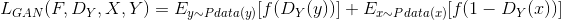

想象阿尔布雷 希特·丢勒(Albrecht Dürer ,1471－1528)大师在文艺复兴时期面对铜镜中的自己画出了世界上第一幅自画像，他的铅笔线条柔和流畅明暗中的人栩栩如生，如果丢勒来到现在的城市公园一脚为富有年轻活力的少女画画像会怎么样？
## cycleGAN
cycleGAN是一种不成对的图像到图像转换的神经网络算法，由Berkeley AI Research (BAIR) laboratory, UC Berkeley在2018年提出。 算法主要基于GAN生成式对抗网络算法。

该算法的原理可以概述为：将一类图片转换成另一类图片。也就是说，现在有两个样本空间，X和Y，我们希望把X空间中的样本转换成Y空间中的样本。因此，实际的目标就是学习从X到Y的映射。我们设这个映射为T。它就对应着GAN中的生成器，F可以将X中的图片x转换为Y中的图片T(x)。对于生成的图片，我们还需要GAN中的判别器来判别它是否为真实图片，由此构成对抗生成网络。设这个判别器为[Dy] 这样的话，根据这里的生成器和判别器，我们就可以构造一个GAN损失(loss函数)，表达式为：

[comment]: <> (a reference style link.)

[公式] :<> (L_{GAN}(F,D_{Y},X,Y)=E_{y\sim Pdata(y)}[f(D_{Y}(y))]+E_{x\sim Pdata(x)}[f(1-D_{Y}(x))])

但单纯的使用这一个损失是无法进行训练的。原因在于，映射F完全可以将所有x都映射为Y空间中的同一张图片，使损失无效化。对此，作者又提出了所谓的“循环一致性损失”（cycle consistency loss）。

我们再假设一个映射R，它可以将Y空间中的图片y转换为X中的图片R(y)。CycleGAN同时学习F和G两个映射，并要求
